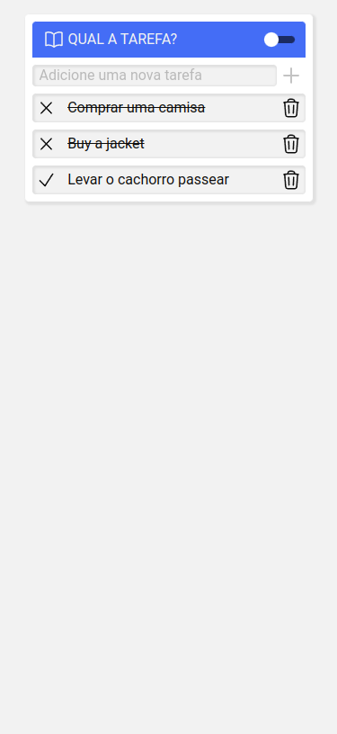
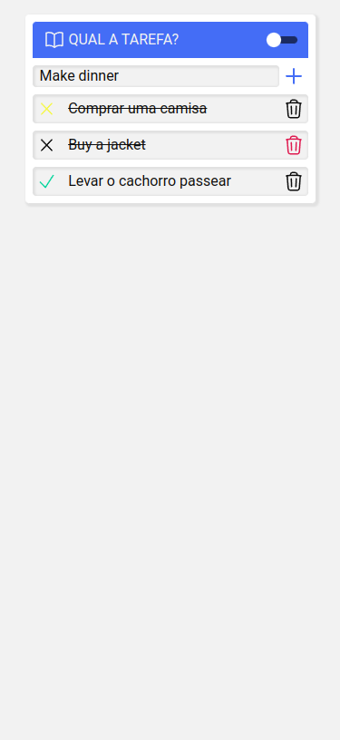
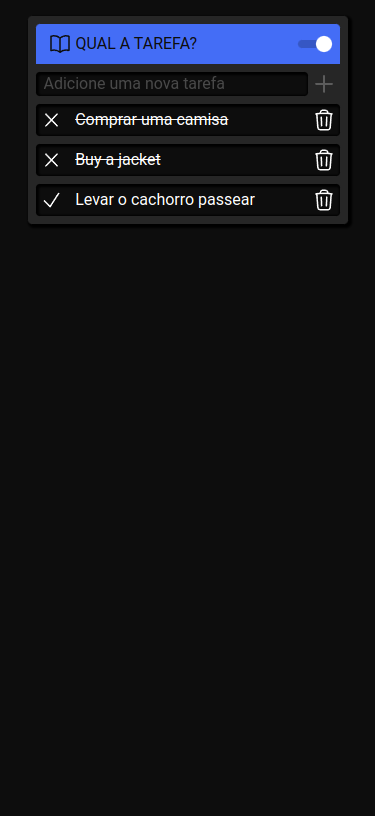
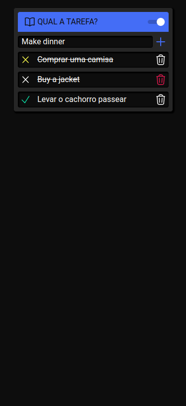

# A simple to-do app built with React, Typescript & Styled Components

This app is built with React, React Hooks and React Switch, Typescript and Styled Components.

## Overview

- [About](#about)
- [Where can I find it?](#where-can-i-find-it)
- [Screenshots](#screenshots)

## About

The user can create tasks, set them as complete, and delete. Any change is saved in local storage to persist data between page reloads.

## Where can I find it?

- Repository - [Github](https://github.com/johnv2309/todo-study)
- Live website - [Netlify](https://google.com/)

## Screenshots

| Project                                 | Hover State                                   |
| --------------------------------------- | --------------------------------------------- |
|  |  |
|   |   |
